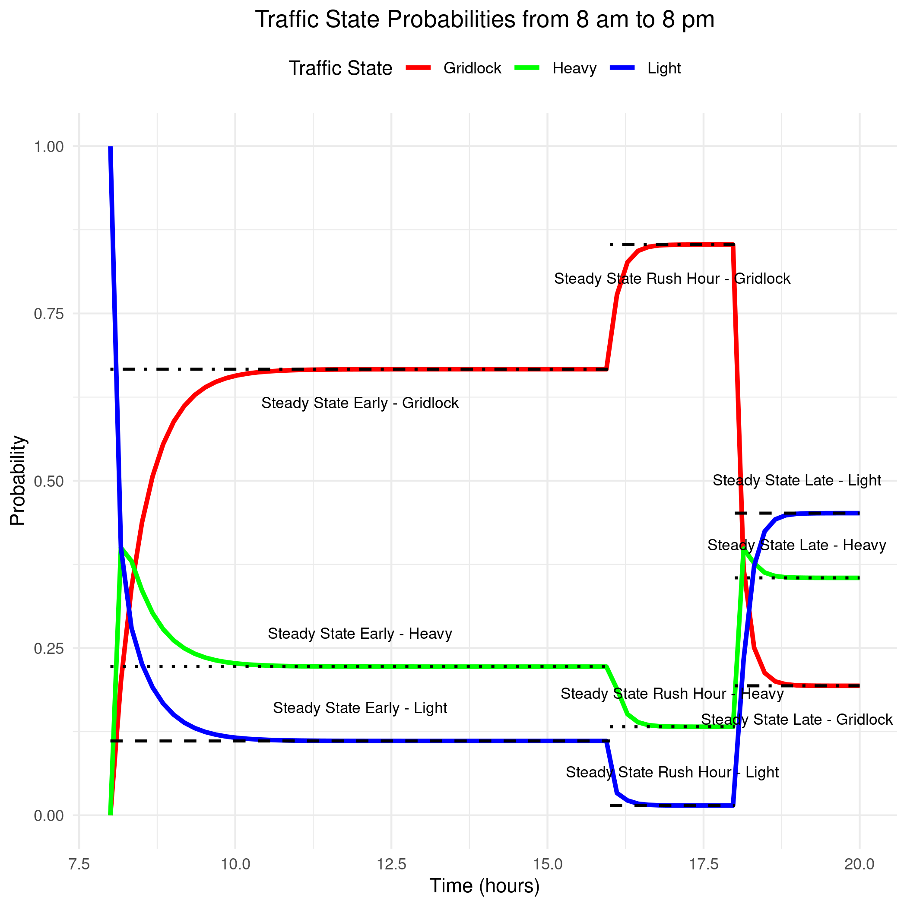

# Modeling Traffic with Markov Chains

This project uses Markov chains to simulate traffic conditions at different times of the day, considering three states: "Light", "Heavy", and "Gridlock". The simulation spans from 8 am to 8 pm, using distinct transition matrices for different periods:

- **Early Period (8 am - 4 pm)**: Light traffic, transitions likely to remain less congested.
- **Rush Hour (4 pm - 6 pm)**: Increased likelihood of moving to "Heavy" or "Gridlock".
- **Late Period (6 pm - 8 pm)**: Traffic eases up as the evening progresses.

The goal is to observe how the probabilities of each traffic state evolve over time, starting with an initial state of 100% probability of "Light" traffic.

## Transition Matrices

The transition matrices for each time period are as follows:

**Early Period (8 am to 4 pm)**:

\[
\begin{bmatrix}
0.4 & 0.4 & 0.2 \\
0.3 & 0.5 & 0.2 \\
0.0 & 0.1 & 0.9
\end{bmatrix}
\]

**Rush Hour Period (4 pm to 6 pm)**:

\[
\begin{bmatrix}
0.1 & 0.5 & 0.4 \\
0.1 & 0.3 & 0.6 \\
0.0 & 0.1 & 0.9
\end{bmatrix}
\]

**Late Period (6 pm to 8 pm)**:

\[
\begin{bmatrix}
0.6 & 0.3 & 0.1 \\
0.4 & 0.4 & 0.2 \\
0.2 & 0.4 & 0.4
\end{bmatrix}
\]

## Code Overview

This project was created using R, and the following libraries are required:

- `ggplot2`: Used for creating visualizations.
- `markovchain`: Used for working with Markov chains.

### 1. Define Transition Matrices

Transition matrices are defined to represent the probabilities of transitioning between different traffic states ("Light", "Heavy", "Gridlock") during different times of the day.

```r
# Early period (8 am to 4 pm)
early_chain <- new("markovchain", 
                   states = c("Light", "Heavy", "Gridlock"),
                   transitionMatrix = matrix(c(0.4, 0.4, 0.2,  # From Light
                                               0.3, 0.5, 0.2,  # From Heavy
                                               0.0, 0.1, 0.9), # From Gridlock
                                             nrow = 3, byrow = TRUE))

# Rush hour period (4 pm to 6 pm)
rush_hour_chain <- new("markovchain", 
                       states = c("Light", "Heavy", "Gridlock"),
                       transitionMatrix = matrix(c(0.1, 0.5, 0.4, 
                                                   0.1, 0.3, 0.6,
                                                   0.0, 0.1, 0.9),
                                                 nrow = 3, byrow = TRUE))

# Late period (6 pm to 8 pm)
late_chain <- new("markovchain", 
                  states = c("Light", "Heavy", "Gridlock"),
                  transitionMatrix = matrix(c(0.6, 0.3, 0.1,
                                              0.4, 0.4, 0.2,
                                              0.2, 0.4, 0.4),
                                            nrow = 3, byrow = TRUE))
```

### 2. Set Initial State

We start the simulation with the assumption that traffic is "Light" with 100% probability.

```r
initial_state <- c(1, 0, 0)   # 100% probability of "Light" traffic
names(initial_state) <- c("Light", "Heavy", "Gridlock")
```

### 3. Simulation Parameters

We set up the parameters for a simulation spanning from 8 am to 8 pm in 10-minute increments (72 time steps).

```r
time_steps <- 72   # 72 time steps (10-minute increments from 8 am to 8 pm)
state_probabilities <- matrix(0, nrow = time_steps, ncol = 3)  # To store results
state_probabilities[1, ] <- initial_state  # Set initial probabilities
colnames(state_probabilities) <- c("Light", "Heavy", "Gridlock")
```

### 4. Simulate Traffic Flow

This loop iterates through each time step, applying the appropriate transition matrix to calculate the probabilities of each traffic state.

```r
for (t in 2:time_steps) { 
  if (t <= 48) {  # Early period (8 am to 4 pm)
    state_probabilities[t, ] <- initial_state %*% early_chain@transitionMatrix 
  } else if (t <= 60) {  # Rush hour period (4 pm to 6 pm)
    state_probabilities[t, ] <- initial_state %*% rush_hour_chain@transitionMatrix
  } else {  # Late period (6 pm to 8 pm)
    state_probabilities[t, ] <- initial_state %*% late_chain@transitionMatrix
  }
  initial_state <- state_probabilities[t, ] # Update for the next time step
}
```

### 5. Prepare Data for Plotting

The results are then converted to a data frame for easy plotting using `ggplot2`.

```r
traffic_df <- data.frame(
  Time = rep(seq(from = 8, to = 20, length.out = time_steps), each = 3), 
  State = factor(rep(c("Light", "Heavy", "Gridlock"), times = time_steps)),
  Probability = as.vector(t(state_probabilities))
)
```

### 6. Calculate and Print Steady State Probabilities

```r
steady_state_early <- steadyStates(early_chain)
steady_state_rush_hour <- steadyStates(rush_hour_chain)
steady_state_late <- steadyStates(late_chain)

print("Steady State Probabilities for Early Period (8 am to 4 pm):")
print(steady_state_early)

print("Steady State Probabilities for Rush Hour (4 pm to 6 pm):")
print(steady_state_rush_hour)

print("Steady State Probabilities for Late Period (6 pm to 8 pm):")
print(steady_state_late)
```

### 7. Visualize the Results

This section uses `ggplot2` to create a line graph showing the probabilities of each traffic state over time, along with dashed lines indicating the steady-state probabilities.

```r
# Basic plot
traffic_plot <- ggplot(traffic_df, aes(x = Time, y = Probability, color = State, linetype = "Simulation")) +
  geom_line(linewidth = 1.2) + 
  labs(title = "Traffic State Probabilities from 8 am to 8 pm",
       x = "Time (hours)",  
       y = "Probability", 
       color = "Traffic State",  
       linetype = "Line Type") +  
  scale_color_manual(values = c("red", "green", "blue")) +  
  theme_minimal() +  
  theme(legend.position = "top", 
        plot.title = element_text(hjust = 0.5)) 

# Add steady state lines (using annotate)
# ... (code for adding lines and annotations - see previous responses) ...

# Save the plot
ggsave("traffic_plot_improved_v4.png", plot = traffic_plot)
```

## How to Interpret the Plot



The plot (`traffic_plot_improved_v4.png`) shows how the probabilities of "Light", "Heavy", and "Gridlock" traffic change throughout the day. The solid lines represent the simulation results, while the dashed lines indicate the steady-state probabilities for each time period.

## Key Findings

- **Early Period (8 am - 4 pm)**: The probability of "Light" traffic is highest during this period, but there's still a chance of encountering "Heavy" or "Gridlock" traffic.
- **Rush Hour (4 pm - 6 pm)**: As expected, the probability of "Heavy" and "Gridlock" traffic increases significantly during rush hour.
- **Late Period (6 pm - 8 pm)**: Traffic conditions gradually improve, with the probability of "Light" traffic increasing again.
- **Steady States**: The dashed lines show the long-term probabilities of each state within each time period. Notice how the probabilities tend to stabilize towards these steady states over time.

